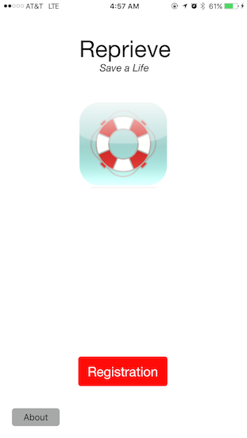
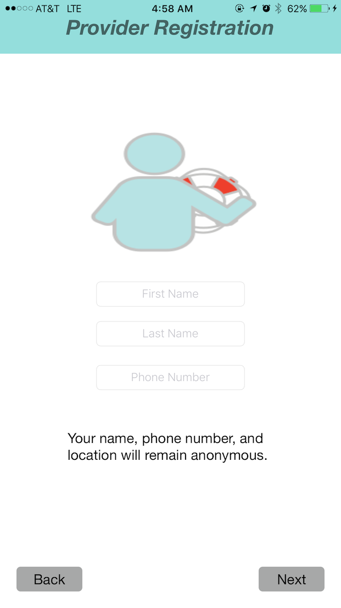
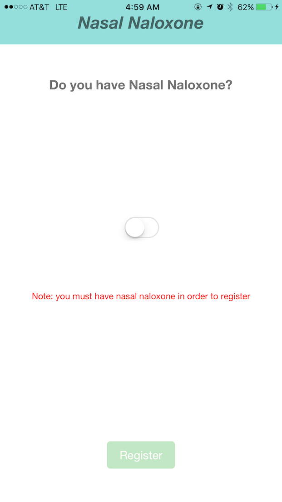
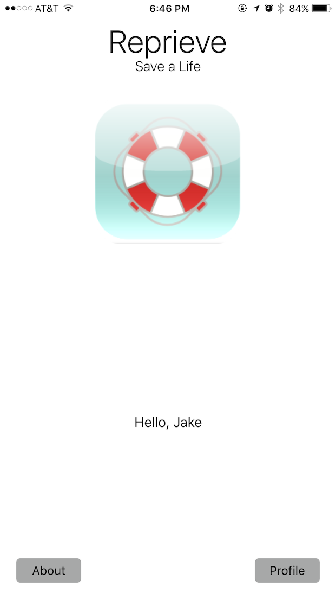
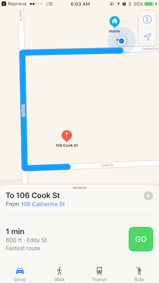

## Reprieve - Overview
Our entry for the _2016 FDA Naloxone App Competition_. This repository includes the three components for this iOS application: the iOS frontend for responders, the iPad dispatch application for county dispatch centers, and the Go backend, which is hosted on a Digital Ocean droplet.

## Members
* Jonathan Byman
* Kevin Guo
* Michael Wagner

## iOS - Client
This is the app that consumers would use and download from the public App Store. They would sign up and say that they are trained and carry nasal naloxone. These apps would be sent a push notification when there is a nearby suspected opioid overdose.

## iOS - Dispatch
These would be the iPad apps that are managed by county emergency dispatch centers. When they are comfortable sending in good samaritans who carry nasal naloxone, they would trigger the dispatch by locating the suspected opioid overdose area. Then the nearby carriers would be alerted. In this way, an ambulance is already en route, and the scene is screened to be safe enough for dispatchers to send civilian carriers.

## Backend
This is the API, written in Go, used to handle requests from both the Reprieve client app, as well as the dispatcher app, and acts as the intermediary and business logic between the two apps. 

## Questions? Comments?
Feel free to shoot an email to jsb396@cornell.edu
